# @russian-flags/arkhangelsk-oblast

[English version](./README.en.md)

Нативная ESM-коллекция SVG-флагов городов Архангельской области. Пакет можно использовать как npm-зависимость в JavaScript/TypeScript-проекте или как набор SVG-файлов с ленивыми загрузчиками.

Список основан на странице Wikipedia ["Городские населённые пункты Архангельской области"](https://ru.wikipedia.org/wiki/Городские_населённые_пункты_Архангельской_области), раздел "Города": 13 городов. Посёлки городского типа не включены.

## Города

| Город | Флаг | slug |
| --- | --- | --- |
| Архангельск | 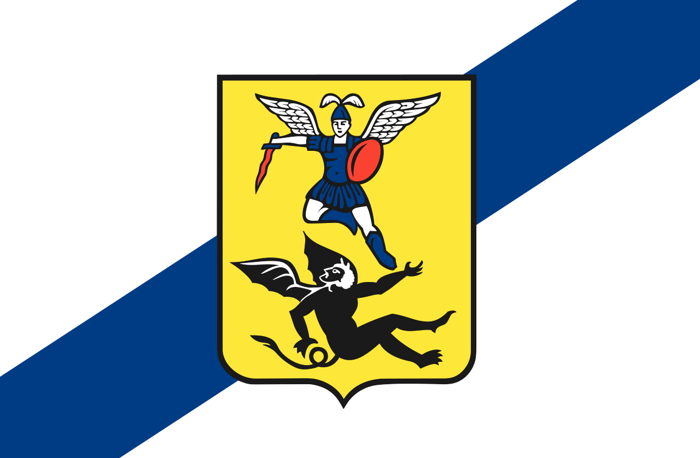 | `arkhangelsk` |
| Северодвинск | 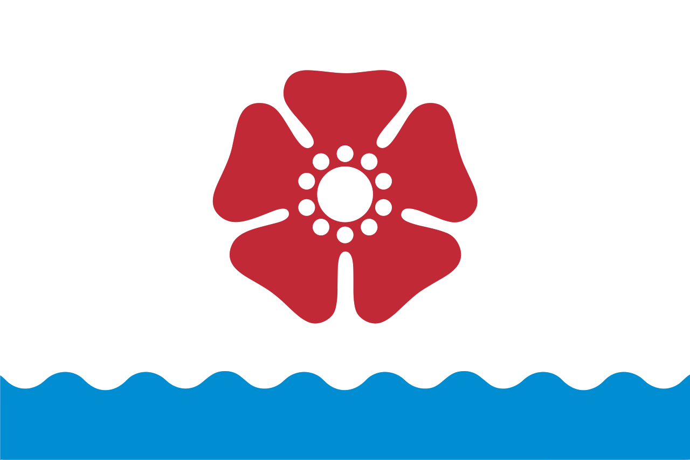 | `severodvinsk` |
| Котлас | 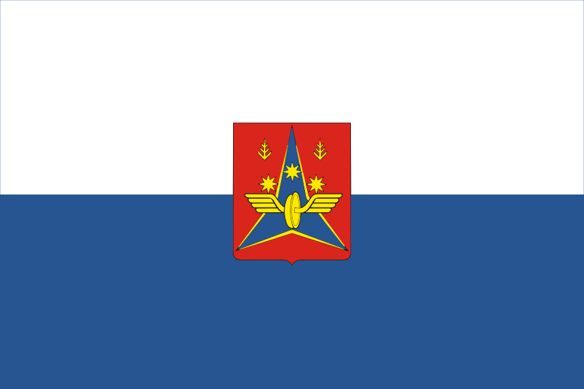 | `kotlas` |
| Новодвинск | 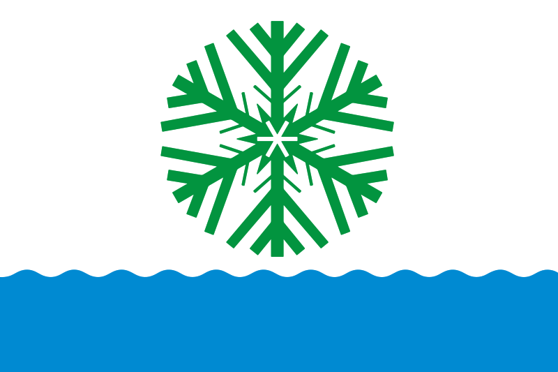 | `novodvinsk` |
| Коряжма | 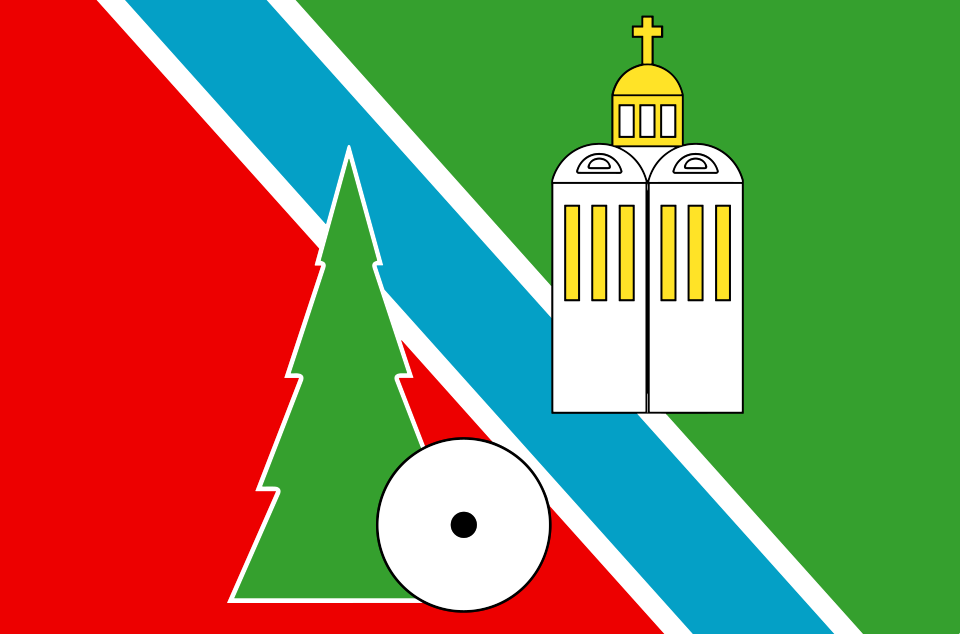 | `koryazhma` |
| Мирный | 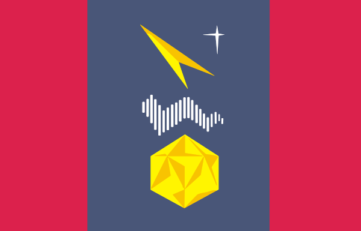 | `mirnyy` |
| Вельск | 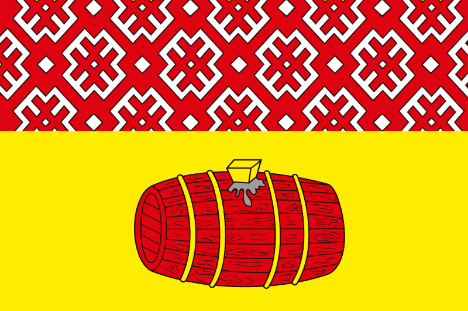 | `velsk` |
| Няндома | 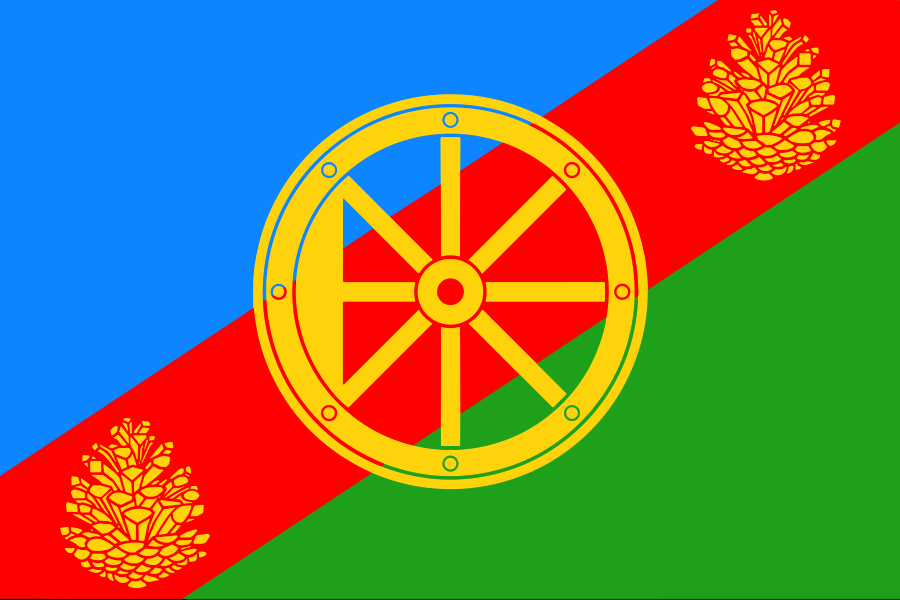 | `nyandoma` |
| Онега | 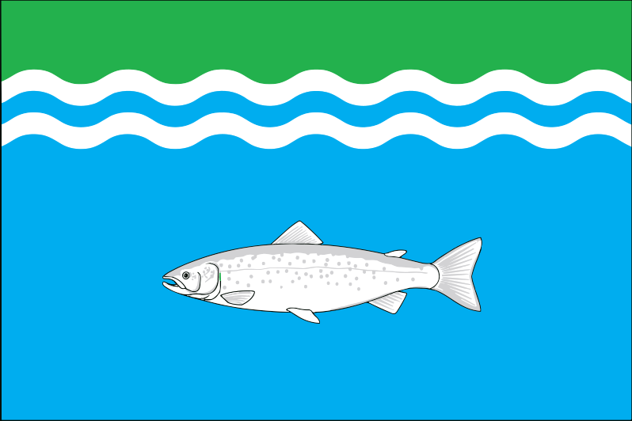 | `onega` |
| Каргополь | 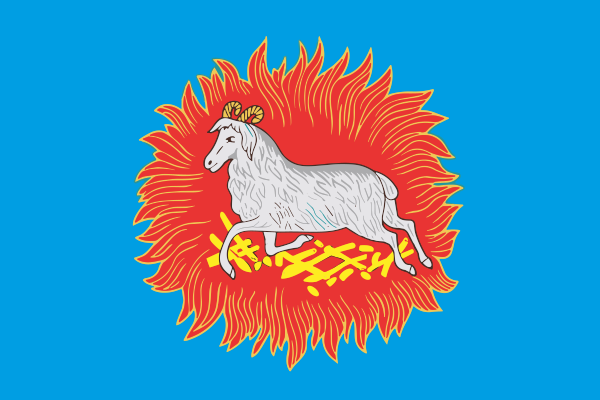 | `kargopol` |
| Шенкурск | 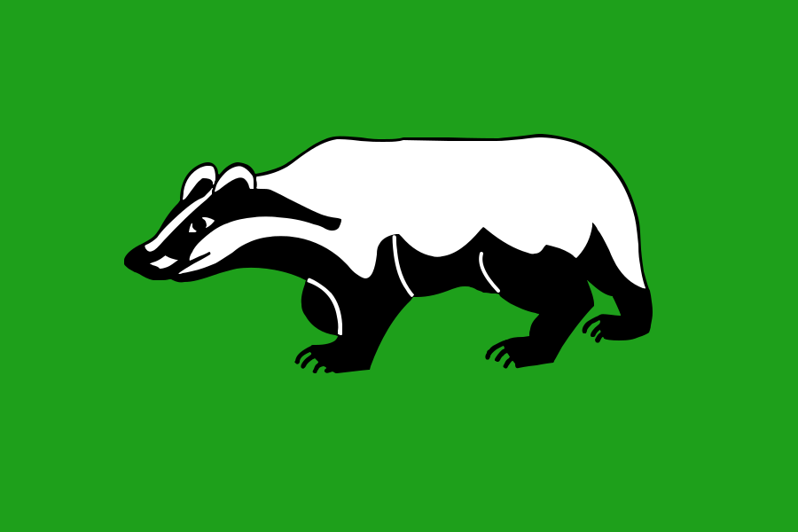 | `shenkursk` |
| Мезень | 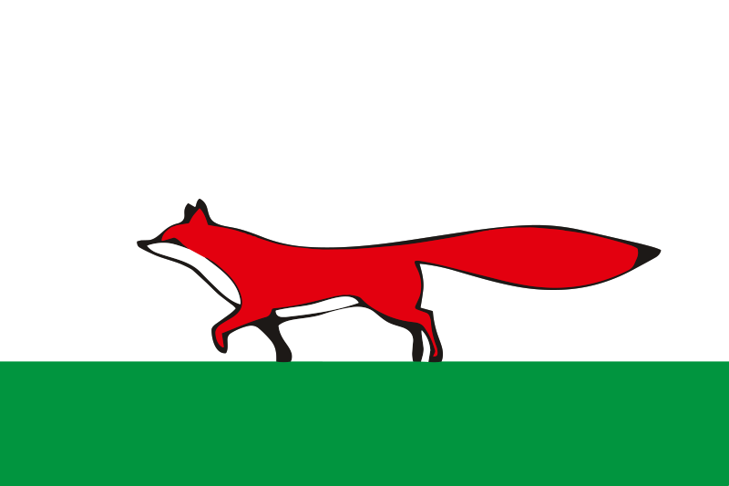 | `mezen` |
| Сольвычегодск | 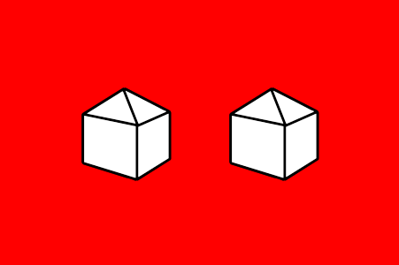 | `solvychegodsk` |

## Возможности

- 13 локальных SVG-флагов в структуре `assets/<slug>/index.svg`.
- ESM-сборка с TypeScript-типами.
- Ленивые загрузчики для каждого флага.
- Поиск города по slug, коду, русскому/английскому названию или alias.
- Прямой импорт SVG через `flags/<slug>` или `svg/<slug>`.

## Установка

```bash
npm install @russian-flags/arkhangelsk-oblast
```

Для локальной проверки из папки проекта:

```bash
npm install .
```

## Быстрый старт

```js
import { loadFlag, settlements } from "@russian-flags/arkhangelsk-oblast";

console.log(settlements.length); // 13

const image = await loadFlag("arkhangelsk", {
  alt: "Флаг Архангельска",
  className: "flag",
});

document.body.append(image);
```

## Подключение SVG напрямую

```js
import arkhangelskFlag from "@russian-flags/arkhangelsk-oblast/flags/arkhangelsk";
import arkhangelskSvg from "@russian-flags/arkhangelsk-oblast/svg/arkhangelsk";

console.log(arkhangelskFlag);
console.log(arkhangelskSvg);
```

Вариант с расширением тоже поддерживается:

```js
import arkhangelskFlag from "@russian-flags/arkhangelsk-oblast/flags/arkhangelsk.svg";
import arkhangelskSvg from "@russian-flags/arkhangelsk-oblast/svg/arkhangelsk.svg";
```

## Поиск города

```js
import {
  resolveSettlementSlug,
  settlementSlugs,
  settlements,
} from "@russian-flags/arkhangelsk-oblast";

console.log(settlementSlugs.includes("arkhangelsk")); // true
console.log(resolveSettlementSlug("Архангельск")); // "arkhangelsk"
console.log(resolveSettlementSlug("Archangelsk")); // "arkhangelsk"
console.log(resolveSettlementSlug("unknown")); // undefined
```

Ввод нормализуется: пробелы по краям удаляются, регистр не важен, `ё` считается как `е`, пробелы и `_` заменяются на `-`.

## API

| Экспорт | Описание |
| --- | --- |
| `settlements` | Массив метаданных `{ slug, code, nameRu, nameEn, aliases }`. |
| `settlementSlugs` | Массив всех доступных slug. |
| `normalizeSettlementInput(input)` | Нормализует пользовательский ввод перед поиском. |
| `resolveSettlementSlug(input)` | Возвращает slug по slug, коду, названию или alias. |
| `getFlagModuleLoader(input)` | Возвращает ленивый загрузчик модуля флага или `undefined`. |
| `loadFlagModule(input)` | Лениво импортирует модуль флага. |
| `loadFlagImage(input, options)` | Загружает флаг и возвращает `HTMLImageElement`. |
| `loadFlag(input, options)` | Алиас для `loadFlagImage`. |
| `preloadFlag(input)` | Запускает загрузку модуля без ожидания результата. |
| `createFlagImage(src, defaultAlt, options)` | Создаёт и настраивает `` для SVG-флага. |

## Разработка

```bash
npm install
npm test
npm run pack:dry
```
